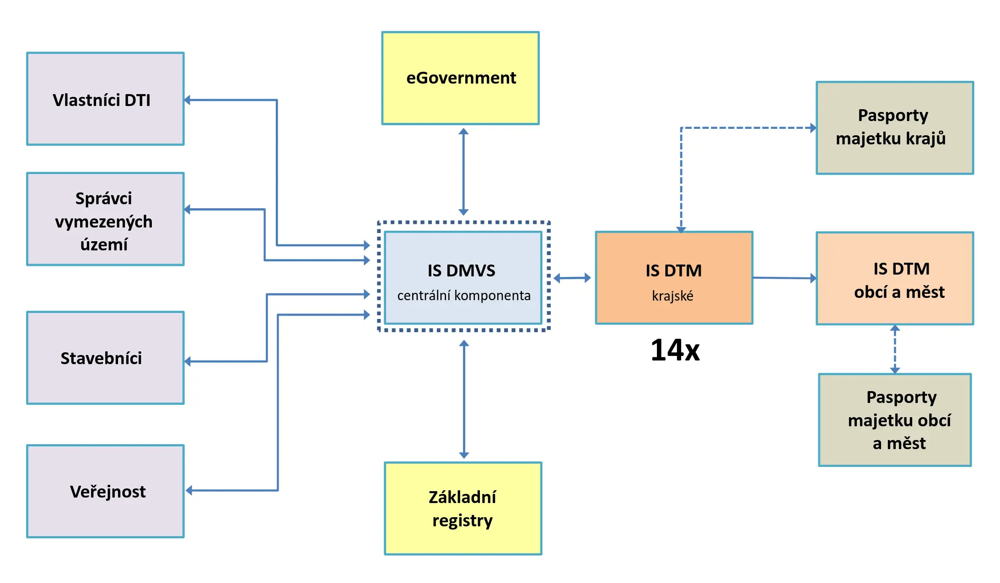

# Digitální mapa veřejné správy a Digitální technická mapa

## Digitální technická mapa (DTM)

- databázový soubor obsahující
	- základní prostorová situace (ZPS)
		- vybrané přírodní, stavební a technické objekty a zařízení
	- dopravní a technická infrastruktura (DTI)
		- údaje o dopravní a technické infrastruktuře
		- záměry na provedení změn dopravní a technické infrastruktury

**Technická infrastruktura (TI)**
- vodovody a kanalizace
- teplovody
- elektrické vedení
- plynovody
- elektronické komunikace
- produktovody

**Dopravní infrastruktura (DI)**
- silniční doprava
- drážní doprava
- letecká doprava
- vodní doprava

**Základní prostorová situace (ZPS)**
- budovy
- chodníky
- ploty
- hřiště
- vodní plochy
- parkoviště

### Vznik DTM

- AK ČR vyzvala v listopadu 2017 MV, MMR a MPO k vytvoření podmínek pro vznik a využití krajských DTM
- výzva AK ČR byla podpořena reálností **financování z prostředků EU**
- novela zákona o zeměměřictví uložila krajům **povinnost vybudovat krajské DTM**
- stavební zákon stanovuje, že pro **územní** a **stavební řízení** bude **DTM jedním ze základních podkladů**

Povinnosti uložené zákonem
- rezort ČÚZK  –  vybudovat Informační systém digitální mapy veřejné správy (IS DMVS), který bude pro krajské DTM zajišťovat služby, které je vhodné provozovat centrálně
- povinnosti i dalším subjektům  –  vlastníci, správci a provozovatelé DTI, stavebníci, ...

### Cíl budování DMVS/DTM

- podpora agend **stavebního řízení** a **územního plánování**
	- projekční a investiční příprava staveb
	- povolování staveb
	- stanovení okruhu vyjadřujících se subjektů (existence/připojení)
- zjednodušení **správy majetku**
	- veřejný majetek (silnice, vodovody, kanalizace, osvětlení, ...)
	- sítě technické a dopravní infrastruktury (vlastníci, provozovatelé)
- rozvoj infrastruktury včetně **vysokorychlostních sítí**
- **zdroj údajů** pro ÚAP, ÚPD, INSPIRE, RÚIAN a z něj do KN

### Důvodová zpráva

- DTM sjednotí, doplní a zpřístupní roztříštěná, neúplná a nepřesná data o veškeré DTI pro území celé ČR
- DTM představuje příležitost pro zlepšení situace v oblasti rozvoje vysokorychlostního internetu v ČR
- vytvoření DTM krajů na území celé ČR a jejich propojení s digitální mapou veřejné správy (DMVS) významně přispěje ke zjednodušení a zrychlení přípravy, umisťování a povolování staveb v ČR
- DTM podstatně zjednoduší práci pořizovatelům ÚP a současně zkvalitní a zjednoduší práci samosprávám při přípravě jak ÚPP, tak samotných ÚPD
- DTM a DMVS dávají prostor ke snížení administrativní zátěže pro stavebníky při přípravě investic, zejména liniových, infrastrukturních staveb a bude též přínosem pro uživatele, resp. občany České republiky, kteří se při svých podnikatelských i soukromých aktivitách snáze dostanou k aktuálním údajům o území
- vznik DTM a DMVS má pozitivní dopad na práci samotných vlastníků a správců infrastrukturních sítí, kterým tyto umožní rychle zjistit případné kolize při plánování a údržbě své infrastruktury s infrastrukturou jiných vlastníků a správců

## Digitální mapa veřejné správy (DMVS)

Komponenty
- **ortofotomapy**  –  centrální řešení (ČÚZK/ZÚ)
- **katastrální mapy**  –  centrální řešení (ČÚZK)
- **krajské DTM**  –  decentralizované řešení (kraje)

**IS DMVS**  –  produkční provoz od 3. 7. 2023

**IS DTM**  –  pilotní od 10. 5. 2024, produkční od 1. 7. 2024

### Schéma DMVS s eGovernmentem a registry

### Obsah DTM kraje

- základní prostorová situace (ZPS)
- dopravní a technická infrastruktura (DTI)
- ochranná a bezpečnostní pásma DTI
- záměry DTI
- objekty GIA (od 1. 7. 2026)

Veřejná a neveřejná část DTM
- veřejné/neveřejné údaje stanoví prováděcí právní předpis
- neveřejné celé třídy atributů nebo vybrané atributy
- není možné označit za neveřejné jen vybrané objekty

Editoři
- pro data DTI a ZPS stanoveni různí editoři a zásadně odlišné principy aktualizace
	- DTI: vlastníci, správci, provozovatelé, respektive jejich editoři,
	- ZPS: pracovníci kraje na základě podkladů od stavebníků (geodetů).
- za správnost, úplnost a aktuálnost zapisovaných údajů zodpovídá editor

### Aktualizace DTM

Geodetická aktualizační dokumentace (GAD)
- aktualizovat ZPS může kdokoli
- objekt ZPS v DTM nemá „majitele“
- neřeší se vlastnictví
- zaměřuje se reálný stav v terénu
- pravidlo „měřím co vidím“
- zdrojem pro aktualizaci ZPS je stavební řízení

Změnové dávky z IS vlastníků, správců nebo provozovatelů
- aktualizují se pouze DTI, které mají vlastníka (správce, provozovatele)
- zaměřují se jen vybrané objekty
- zaměřuje se reálný stav v terénu
- pravidlo „vím co měřím“
- zdrojem pro aktualizaci DTI je stavební řízení